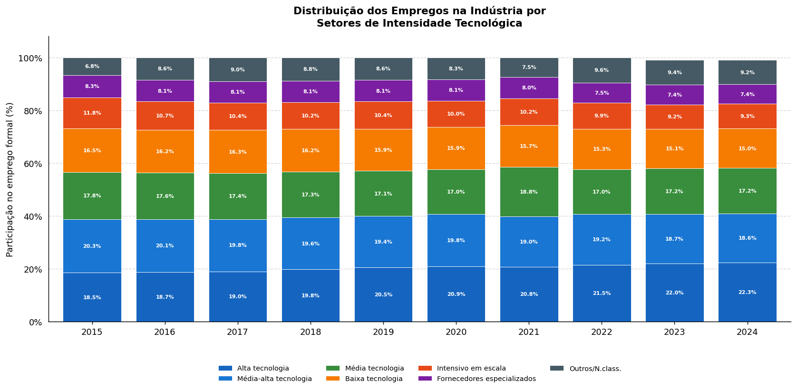
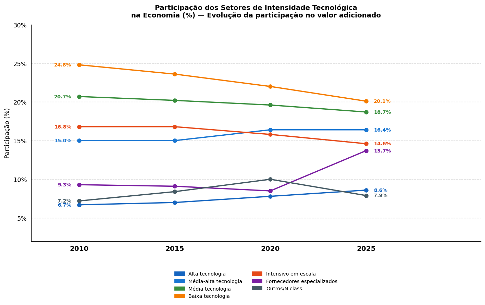
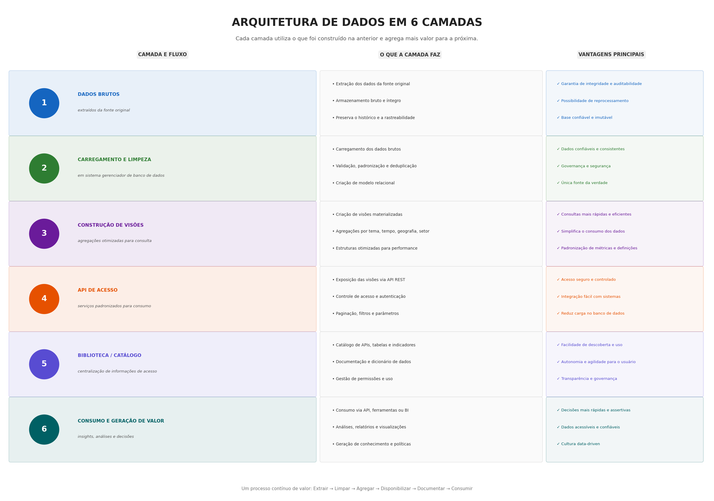

---
format:
  revealjs:
    theme: [default, custom.scss]
    title-slide: false
    slide-number: true
    transition: slide
    css: assets/capa.css
    hash: false
---

## {data-menu-title="Capa" background-color="white"}

:::: {.columns style="height:100%;align-items:center;"}
::: {.column style="width:45%;padding:0;"}
{style="width:100%;max-height:82vh;object-fit:cover;border-radius:12px;"}
:::
::: {.column style="width:55%;padding-left:2.5rem;"}
[Contação de histórias de dados na prática]{style="font-size:1.55em;line-height:1.25;font-weight:800;display:block;margin-bottom:0.7rem;color:#111;"}

Entendendo princípios de visualização de dados e contação de histórias de dados de forma prática

::: {.tag style="margin-top:1.2rem;"}
MERCADO DE TRABALHO
:::
:::
::::

---

## O que vamos aprender hoje?

Esta aula cobre os fundamentos para você trabalhar contação de história de dados utilizando a RAIS como fonte para a análise.

:::: {.agenda-grid}
::: {.card-agenda}
[01]{.agenda-num}

**Contação de Histórias de Dados**

Princípios de contação de histórias com dados
:::

::: {.card-agenda}
[02]{.agenda-num}

**Visualização de Dados**

Um gráfico para cada tipo de dado
:::

::: {.card-agenda}
[03]{.agenda-num}

**O que é a RAIS**

Cobertura, periodicidade e unidade de análise
:::

::: {.card-agenda}
[04]{.agenda-num}

**Biblioteca SDIC**

Apresentação da biblioteca de acesso centralizado aos dados de Emprego
:::

::: {.card-agenda}
[05]{.agenda-num}

**Hora da Prática**

Aplicando conceitos com R e Python para visualização de dados de emprego (RAIS e CAGED)
:::
::::

---

## O que é Contação de Histórias de Dados\*?

A arte de transformar dados complexos em narrativas claras e envolventes, tornando insights acessíveis e acionáveis para qualquer público. É a ponte entre números e significado.

:::: {.columns}
::: {.column style="width:55%;"}
#### Por que usar Data Storytelling?

:::: {.grid-2 style="margin-top:0.5rem;"}
::: {.feature-item}
**Simplifica a Complexidade**

Converte dados brutos em insights fáceis de compreender.
:::

::: {.feature-item}
**Aumenta o Impacto**

Vai além dos números, gerando conexão emocional e memorização.
:::

::: {.feature-item}
**Facilita Decisões**

Direciona ações estratégicas com base em evidências sólidas.
:::

::: {.feature-item}
**Engaja o Público**

Prende a atenção e inspira mudanças e colaboração.
:::
::::
:::

::: {.column style="width:45%;"}
::: {.info-box style="margin-top:4rem;"}
\*Data Storytelling é o termo em inglês relacionado à combinação de dados, visualizações e narrativa para comunicar insights de forma clara e memorável.
:::
:::
::::

---

## Storytelling de Dados: A Pergunta Analítica

Todo bom storytelling de dados parte de perguntas claras e bem formuladas. Elas guiam a análise e a escolha da visualização.

::: {.tag}
EXEMPLO PRÁTICO — MERCADO DE TRABALHO NA INDÚSTRIA
:::

:::: {.grid-3 style="margin-top:0.8rem;"}
::: {.card-q}
::: {.card-q-num}
1
:::
**Distribuição por Grupo Tecnológico**

Como o emprego se distribui entre grupos tecnológicos da indústria em dois períodos distintos?
:::

::: {.card-q}
::: {.card-q-num}
2
:::
**Variação do Peso Relativo**

O peso relativo de cada grupo mudou significativamente entre os períodos?
:::

::: {.card-q}
::: {.card-q-num}
3
:::
**Transformação Estrutural**

Observamos uma transformação estrutural ou apenas crescimento geral do emprego?
:::
::::

::: {.bold-q}
Quais as Visualizações mais Adequadas para Responder a Essas Perguntas?
:::

---

## Alfabetização Visual: escolhendo o gráfico certo

O tipo de dado deve guiar a escolha da visualização — nunca o contrário.

:::: {.grid-2 style="margin-top:0.6rem;"}
::: {.feature-item}
**Barras e Colunas**

Comparar setores, sexo, escolaridade ou regiões. Ideal para **rankings e comparações diretas**.
:::

::: {.feature-item}
**Linhas**

Séries históricas de emprego, massa salarial. Revela **tendências, sazonalidade e quebras estruturais**.
:::

::: {.feature-item}
**Histogramas**

Distribuição de salários, idade e tempo de vínculo. Mostra **assimetria e concentração**.
:::

::: {.feature-item}
**Boxplot**

Comparar salários por setor, gênero ou região. Destaca **mediana, quartis e outliers**.
:::

::: {.feature-item}
**Dispersão**

Escolaridade × salário, porte × remuneração. Identifica **correlações e clusters**.
:::

::: {.feature-item}
**Mapas**

Distribuição regional e concentração territorial. Diferencia **valor absoluto de relativo**.
:::
::::

---

## Escolha das Visualizações: Exemplo Prático

::: {.tag}
EXEMPLO PRÁTICO — MERCADO DE TRABALHO NA INDÚSTRIA
:::

:::: {.columns style="margin-top:0.6rem;align-items:flex-start;"}
::: {.column style="width:50%;padding-right:1rem;"}
**Gráfico de Barras Empilhadas**

Ideal para visualizar a **distribuição total** por grupos tecnológicos em cada período — mostra proporção e total simultaneamente.

{style="width:100%;border-radius:6px;box-shadow:0 2px 8px rgba(0,0,0,0.12);"}
:::

::: {.column style="width:50%;padding-left:0.5rem;"}
**Gráfico de Inclinação (Slope Chart)**

Perfeito para ilustrar a **mudança no peso relativo** de cada grupo entre períodos — destaca ganhos e perdas de participação.

{style="width:100%;border-radius:6px;box-shadow:0 2px 8px rgba(0,0,0,0.12);"}
:::
::::

---

## {data-menu-title="O que é a RAIS?" background-color="white"}

:::: {.columns style="height:100%;align-items:center;"}
::: {.column style="width:55%;"}
::: {.section-tag}
APRESENTAÇÃO DA BASE DE DADOS
:::

[O que é a RAIS?]{style="font-size:1.6em;font-weight:800;display:block;margin:0.5rem 0 0.8rem;color:#111;"}

A **Relação Anual de Informações Sociais** é um registro administrativo obrigatório, declarado anualmente pelos estabelecimentos ao Ministério do Trabalho. É a principal fonte de dados sobre o **emprego formal** no Brasil.
:::

::: {.column style="width:45%;"}
{style="width:100%;max-height:75vh;object-fit:cover;border-radius:12px;"}
:::
::::

---

## Estrutura e cobertura da RAIS

:::: {.columns style="align-items:flex-start;"}
::: {.column style="width:48%;"}
{style="width:100%;max-height:44vh;object-fit:cover;border-radius:10px;"}

::: {.info-box style="font-size:0.65em;margin-top:0.5rem;"}
O que **não está** na RAIS: trabalhadores informais, autônomos sem vínculo, MEIs sem empregados e alguns vínculos estatutários.
:::
:::

::: {.column style="width:52%;padding-left:1.5rem;font-size:0.82em;"}
**O que a RAIS mede?**

- **Unidade de análise:** o vínculo empregatício (não o trabalhador)
- **Periodicidade:** anual — retrato do estoque em 31/12
- **Cobertura:** emprego formal (CLT, estatutários, temporários)

**RAIS Completa vs. RAIS Negativa**

- **Completa:** estabelecimentos com pelo menos um vínculo ativo
- **Negativa:** estabelecimentos sem vínculos no ano-base
:::
::::

---

## Perguntas fundamentais antes de analisar

Antes de qualquer análise, faça sempre estas três perguntas orientadoras:

:::: {.grid-3 style="margin-top:1.2rem;"}
::: {.card-q style="background:#f0f0f8;"}
**O que cada linha representa?**

Um **vínculo empregatício** — não um trabalhador único. Um mesmo trabalhador pode ter múltiplos vínculos no ano.
:::

::: {.card-q style="background:#f0f0f8;"}
**Quem declara?**

O **estabelecimento empregador** — não o trabalhador. A qualidade dos dados depende da regularidade da declaração.
:::

::: {.card-q style="background:#f0f0f8;"}
**O que posso analisar?**

Estoque, fluxo, distribuição setorial, remuneração, perfil do trabalhador formal — dentro da cobertura do emprego formal.
:::
::::

---

## Biblioteca SDIC: Acesso Centralizado aos Dados

:::: {.columns style="align-items:center;"}
::: {.column style="width:50%;"}
A Biblioteca SDIC (Sistema de Dados de Interesse Coletivo) é sua fonte unificada para informações cruciais sobre o mercado de trabalho.

:::: {.grid-2 style="margin-top:0.8rem;"}
::: {.feature-item}
**Acesso Unificado**

Todos os dados de interesse coletivo, incluindo RAIS, em um só lugar.
:::

::: {.feature-item}
**Descoberta Simplificada**

Encontre informações sem a complexidade de bases desagregadas.
:::

::: {.feature-item}
**Padronização e Qualidade**

Dados consistentemente padronizados e documentados.
:::

::: {.feature-item}
**Agilidade para Insights**

Foque na geração de valor em vez da coleta e processamento de dados.
:::
::::
:::

::: {.column style="width:50%;"}
{style="width:100%;border-radius:12px;box-shadow:0 4px 20px rgba(0,0,0,0.15);"}
:::
::::

---

## Arquitetura de Dados em 6 Camadas

{style="width:100%;max-height:82vh;object-fit:contain;"}

---

## Hora da Prática: Aplicando Conceitos com R e Python

:::: {.columns style="align-items:flex-start;"}
::: {.column style="width:55%;"}
::: {.practice-box}
[**O que vamos fazer?**]{.practice-title}

- Aprender a utilizar a biblioteca sdic por meio de exemplos práticos
- Resolver exercícios de análise e visualização de dados
- Construir gráficos que comuniquem uma mensagem com clareza
- Aplicar princípios de data storytelling em cenários reais
- Explorar como adaptar a visualização ao público e ao contexto
:::
:::

::: {.column style="width:45%;padding-left:2rem;"}
#### Ambientes para prática

- **R:**

- **Python:**
:::
::::
